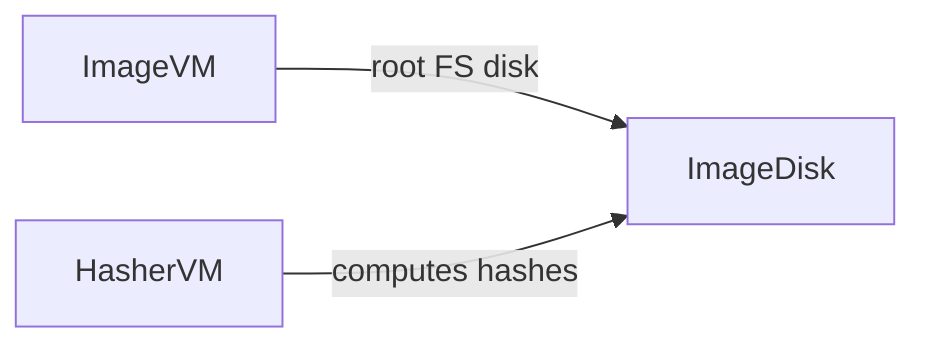

# CLI for SLSA BuildEnv Track

This is a proof-of-concept for the OpenSSF SLSA draft
[Attested Build Environments (BuildEnv) track](https://github.com/slsa-framework/slsa/issues/975).

The CLI in this repo implements vTPM-based attestation and
integrity checking of a Linux VM image running in Azure. This repo also provides
demo GHA workflows showcasing how to meet SLSA BuildEnv L1 and L2 (WIP).

This Demo uses 2 VMs - `ImageVM` and `HasherVM`.
- `ImageVM` is used to build the target image, it could be populated with all the tools and data needed
- `HasherVM` is a "worker" VM whose sole purpose is to compute Verity tree over the ImageVM root FS.

Once `HasherVM` completes setting up `ImageDisk` it could be snapshotted to create clones of the `ImageVM`.

Both VMs have to be trusted given that they have write access to the image root file system. Build image providers operating at BuildEnv 3 level should be protecting disk integrity while in use and at rest (as disk is reattached from ImageVM to the HasherVM), e.g. by encrypting the disk.

## Image configuration

Image has 3 notable partitions - `boot`, `root file system` and `verity tree`. Verity tree contains hashes for the root file system. Verity configuration data (e.g., root hash) is passed in a well-known configuration file within the boot partition. This file is processed by `initrd` to properly initialize (i.e. open) Verity device. Root hash is measured into TPM and hence is present in the remote attestation quote.

Initrd sets up OverlayFS for the root file system using local ephemeral disk as a storage device. Build environments are ephemeral at `Build L3` and intermediate data is not expected to be preserved upon the termination of the environment. To achieve `BuildEnv L3` temporary storage must be encrypted, which could be done with an ephemeral key generated in Initrd upon booting the environment.  `BuildEnv L2` does not require encryption.

GRUB environment block is disabled to prevent unintended modificaton of the root file system upon booting. 

## How To Use

### Configure Azure account

_You need to have Azure account to run this demo_

Few configuration settings need to be defined in [Actions secrets](https://docs.github.com/en/actions/how-tos/write-workflows/choose-what-workflows-do/use-secrets). None of these are secrets per se but they are treated as secrets to reduce visibility of private resources in public Actions workflow logs:
- `AZURE_SUBSCRIPTION_ID` - Azure subscription id that you have `Owner` access to
- `AZURE_RESOURCE_GROUP` - resource group name where VM and all associated resources are provisioned
- `AZURE_TENANT_ID` - Azure Entra tenant id where App is located
- `AZURE_CLIENT_ID` - Azure app id for accessing subscription from the Actions workflow (**MUST** have `Contributor` access to the subscription)
- `AZURE_LOCATION` - location where VM is provisioned (e.g. `eastus`)
- `AZURE_VM_NAME` - Name to be used for the VM

You need to configure OIDC credentials for the app to let Actions workflow acquire access token for this app ([doc link](https://docs.github.com/en/actions/how-tos/secure-your-work/security-harden-deployments/oidc-in-azure)).

### Dispath the workflow

Dispatch `Image Build` workflow to run this demo. Workflow will build a VM and give you access to this VM by adding GitHub actor public keys into the authorized keys for the `azureuser`. Keys are downloaded from `https://github.com/<your alias>.keys`

After the VM is built you will be able to SSH to the VM with `ssh azureuser@<ip address>` and poke around.

### CLI

Requires Go 1.21+

## TODOs

* Implement DSSE signing for `ref-values` command
* Modify `verify` command to use reference value attestations, rather than raw inputs
* Document verifier VM attestation flow
* Document private key config and signing attestation
* Add binding attestation + signature for the job id
* Add build image components for container-based build
* Add verification of SLSA Provenance + VSA generation
* Add verification of "boot" in container-based build environment
* Add mock build platform
* Add mock L3 container-based build environment deployment with HW TPM

## Disclaimer

This project is not ready for production use.
